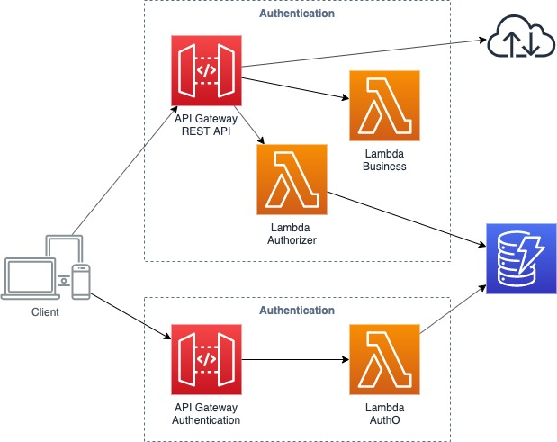

# AWS API Gateway with Custom Authorizers

[Lambda 권한 부여자 사용 AWS Document](https://docs.aws.amazon.com/ko_kr/apigateway/latest/developerguide/apigateway-use-lambda-authorizer.html)

## Lambda 권한 부여자 인증 워크플로우


1. 클라이언트가 API Gateway API 메서드의 메서드를 호출하고 보유자 토큰이나 요청 파라미터를 전달합니다.
2. API Gateway는 Lambda 권한 부여자가 메서드에 대해 구성되어 있는지 여부를 확인합니다. 구성되어 있으면 API Gateway가 Lambda 함수를 호출합니다.
3. Lambda 함수는 다음과 같은 방법을 통해 호출자를 인증합니다.
    - OAuth 공급자를 호출하여 OAuth 액세스 토큰을 받습니다.
    - SAML 공급자를 호출하여 SAML 어설션을 받습니다.
    - 요청 파라미터 값을 기반으로 IAM 정책을 생성합니다.
    - 데이터베이스에서 자격 증명을 가져옵니다.

4. 호출이 성공하면 Lambda 함수는 한 개 이상의 IAM 정책과 보안 주체 식별자를 포함하는 출력 객체를 반환하여 액세스를 부여합니다.
5. API Gateway는 정책을 평가합니다.
    - 액세스가 거부되면 API Gateway는 적절한 HTTP 상태 코드(예: 403 ACCESS_DENIED)를 반환합니다.
    - 액세스가 허용되면 API Gateway는 메서드를 실행합니다. 권한 부여자 설정에서 캐싱이 활성화된 경우, API Gateway는 Lambda 권한 부여자 함수를 다시 호출할 필요가 없도록 정책을 캐싱합니다.

> ### 1. 구성도


> ### 2. API Gateway
  - AWS Management Console > API Gateaway
  - API 선택 > Authorizers
  - Create New Authorizer
    - Name : 권한 부여자 이름
    - Type : Lambda 선택
    - Lambda Function : Authorizer Lambda 선택
    - Lambda Invoke Role : Lambda 함수를 호출할 수 있는 권한
    - Lambda Event Payload : TOKEN 권한 부여자의 경우 토큰, REQUEST 권한 부여자의 경우 요청을 선택
    - Create
  - API Resouces > Method > Method Request
  - Authorization 선택

> ### 3. DynamoDB
  - AWS Management Console > DynamoDB > Create Table
    - Table Name 
    - Primary Key : ReqId

> ### 4. Lambda
  - Authentication
  ```js
const randomBytes = require('crypto').randomBytes;
const AWS = require('aws-sdk');
const ddb = new AWS.DynamoDB.DocumentClient();

exports.handler = (event, context, callback) => {
    const reqId = toUrlString(randomBytes(16));
    console.log('Received event (', reqId, '): ', event);

    const username = event['username'];

    recordToken(reqId, username).then(() => {
        callback(null, {
            statusCode: 201,
            body: JSON.stringify({
                ReqId: reqId
            }),
            headers: {
                'Access-Control-Allow-Origin': '*',
            },
        });
    }).catch((err) => {
        console.error(err);
        errorResponse(err.message, context.awsRequestId, callback)
    });
};

function recordToken(reqId, username) {
    return ddb.put({
        TableName: 'AuthO',
        Item: {
            ReqId: reqId,
            User: username,
            RequestTime: new Date().toISOString(),
        },
    }).promise();
}

function toUrlString(buffer) {
    return buffer.toString('base64')
        .replace(/\+/g, '-')
        .replace(/\//g, '_')
        .replace(/=/g, '');
}

function errorResponse(errorMessage, awsRequestId, callback) {
  callback(null, {
    statusCode: 500,
    body: JSON.stringify({
      Error: errorMessage,
      Reference: awsRequestId,
    }),
    headers: {
      'Access-Control-Allow-Origin': '*',
    },
  });
}
  ```
  - Authorization
  ```js
const AWS = require('aws-sdk');
const ddb = new AWS.DynamoDB.DocumentClient();

exports.handler = (event, context, callback) => {
    const reqId = event['authorizationToken'];
    console.log('Received event (', reqId, '): ', event);

    var params = {
        TableName: "AuthO",
        Key:{
            "ReqId": reqId
        }
    };

    ddb.get(params, function(err, data) {
        if (err) {
            console.error("Unable to read item. Error JSON:", JSON.stringify(err, null, 2));
            callback("Error: Invalid token"); // Return a 500 Invalid token response
        } else {
            callback(null, generatePolicy('user', 'Allow', event.methodArn));
        }
    });
};

function errorResponse(errorMessage, awsRequestId, callback) {
  callback(null, {
    statusCode: 500,
    body: JSON.stringify({
      Error: errorMessage,
      Reference: awsRequestId,
    }),
    headers: {
      'Access-Control-Allow-Origin': '*',
    },
  });
}

// Help function to generate an IAM policy
var generatePolicy = function(principalId, effect, resource) {
    var authResponse = {};
    
    authResponse.principalId = principalId;
    if (effect && resource) {
        var policyDocument = {};
        policyDocument.Version = '2012-10-17'; 
        policyDocument.Statement = [];
        var statementOne = {};
        statementOne.Action = 'execute-api:Invoke'; 
        statementOne.Effect = effect;
        statementOne.Resource = resource;
        policyDocument.Statement[0] = statementOne;
        authResponse.policyDocument = policyDocument;
    }
    
    // Optional output with custom properties of the String, Number or Boolean type.
    authResponse.context = {
        "stringKey": "stringval",
        "numberKey": 123,
        "booleanKey": true
    };
    
    return authResponse;
}
  ```
> ### 5. Test
  - Postman
  - Header
    - authorizationToken : 확인
    - methodArn : API Gateway > API > Resources > Method > Method Request
    ```json
    [
        {
            "key":"authorizationToken",      "value":"********************"
        },
        {
            "key":"methodArn","value":"arn:aws:execute-api:ap-northeast-2:............:xxxxxxxxxx/*/GET/"
        }
    ]
    ```
  - Send
